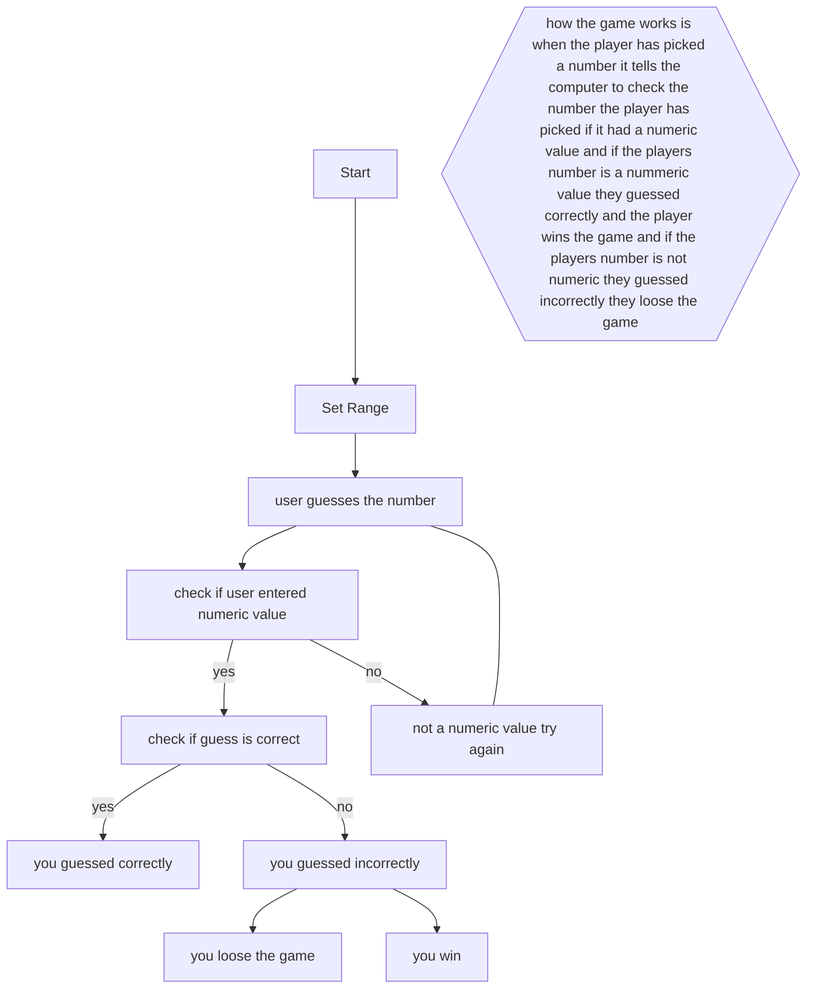

```mermaid
flowchart TD
  A[Start] --> B[Set Range] --> C[user guesses the number] --> D[check if user entered numeric value]
  D -->|yes| E[check if guess is correct]
  D -->|no| F[not a numeric value try again]
  F --- C
  E -->|yes| G[you guessed correctly]
  E -->|no| H[you guessed incorrectly]
  H --> I[you loose the game]
  H --> J[you win]
  id1{{how the game works is when the player has picked a number it tells the computer to check the number the player has picked if it had a numeric value and if the players number is a nummeric value they guessed correctly and the player wins the game and if the players number is not numeric they guessed incorrectly they loose the game}}

```
